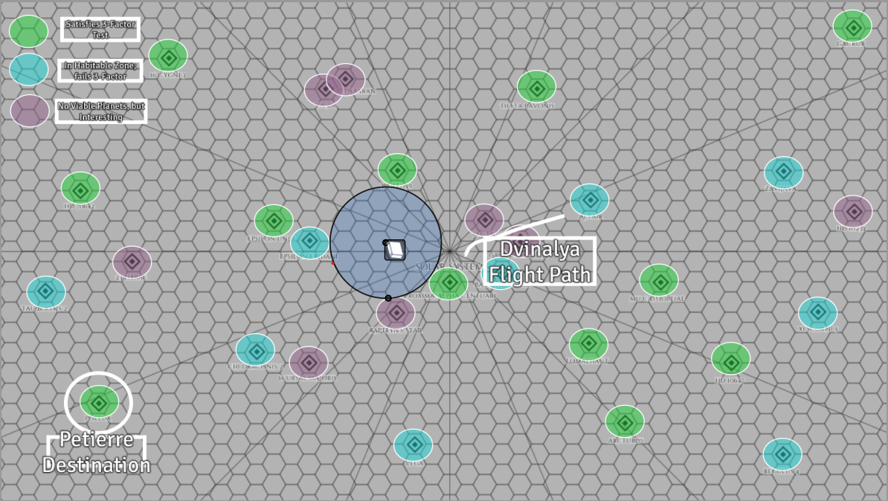

# About
A seedship is a spacecraft designed for exodus. Within it is the sum total of your culture; or what you could take with you, at least. Genetic information for people and animals, embryo and gestation manufacturing plants, food stocks, and grow-vats, technical and cultural data libraries, workshops, anything and everything. 

In this game, we play as key-crew to one of three Martian Seedships fleeing from a genocidal Alien threat that has ripped through Sol, killing most of the population and enslaving others. 

# Getting Started
Browse the major historical (pre-session) events that prompted Mars to invest in its Seedship program in our [[History of Earth and Sol]] page.

